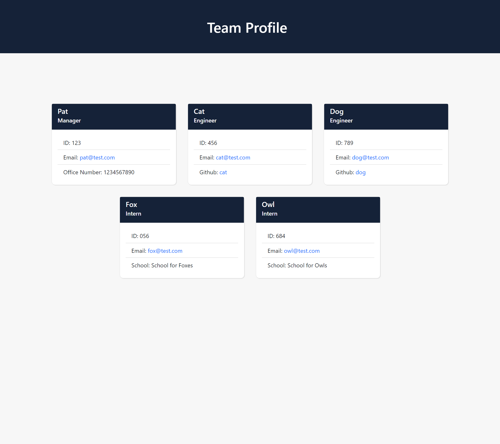

# Team Profile Generator

Node.js command-line app to generate a team profile on a HTML webpage. Uses Object Oriented Programming, Jest, Inquirer and ES6 to dynamically generate a team profile based on inputs.

## Table of Contents

* [Setup](#setup)
* [Usage](#usage)
* [Tests](#tests)
* [Contributing](#contributing)
* [License](#license)

## Setup
:floppy_disk:

Fork or clone this repository and open the files within to access the command prompt.

Requires Node.js and npm (Node Package Manager). Go to [Node's website](https://nodejs.org/en/) and follow the download instructions for your appropriate setup. NPM, or Node Package Manager, is the default package manager for Node.js. It is distributed with Node.js. Do not forget to npm init if you are using it for the very first time.

Run `npm install` in order to install the following npm package dependencies as specified in the `package.json`:
- [Jest](https://jestjs.io/) will help test scripts if you wish to change names or variables. Please check that after installing Jest via terminal, the "test" value is not `"echo \"Error: no test specified\" && exit 1"` in the `package.json` file. If it is, change the "test" value to `"jest"` within the `package.json` file for the Jest program to work.
- [Inquirer.js](https://www.npmjs.com/package/inquirer) will prompt you for inputs from the command line.

`npm init`

`npm install --save-dev jest`

`npm install inquirer`

Start the application by running `node app` in the command line.

## Usage

:computer:

Run `node app` in the command line and it will give out a series of prompts to build a team profile.

After filling out the manager's name, employee ID, email address, and office number, you will be prompted the option to add an engineer or intern to finish building the team.

If `engineer` was selected, you will be prompted for the engineer's name, ID, email, and Github username.

If `intern` was selected, you will be prompted for the intern's name, ID, email, and school.

After finishing your inputs, the app will generate an HTML page and copy a sourced CSS file. The files can be found within the `dist` folder.

A demonstration can be found below:

## Tests

:gear:

To run tests in this project, open up the terminal associated with the files. Ensure that C:\filePath is in the correct location. Be sure to have all files associated with `npm` and `jest` installed.

Within the terminal, you can type the following commands to activate the tests:

`npm run test`

`npm run test Employee`

`npm run test Engineer`

`npm run test Intern`

`npm run test Manager`

See the gif below for an example:

## Contributing

:octocat:

[paperpatch](https://github.com/paperpatch)

## License

:receipt:

This project is licensed under MIT.